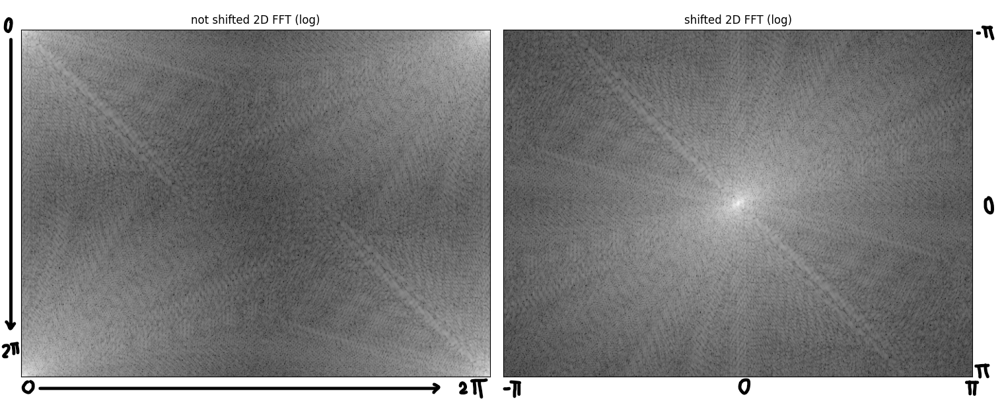
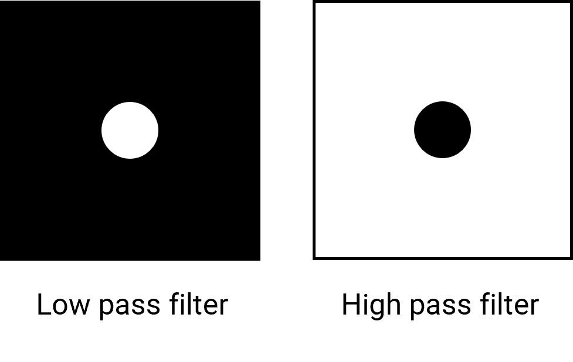
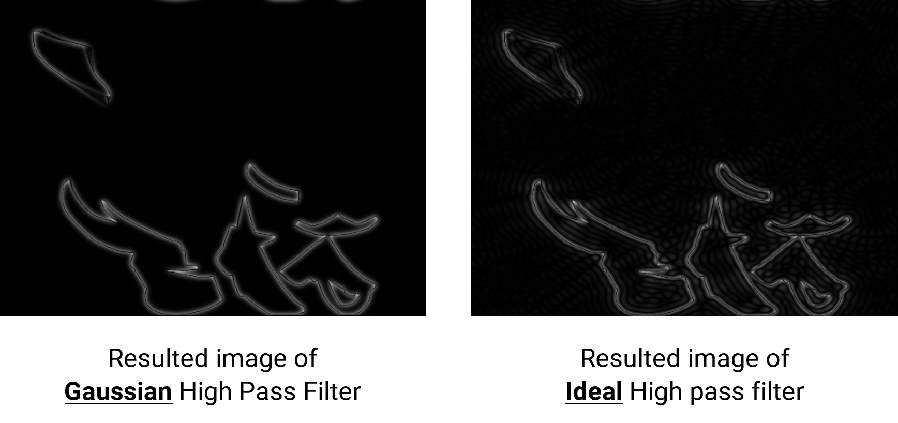

<h1 align="center">2D Image and Fourier Analysis</h1>

---

### **Table of Contents**

- [**Background**](#background)
- [**2-dimensional Fourier Transform**](#2-dimensional-fourier-transform)
- [**Filters**](#filters)
  - [1. Low Pass and High Pass filter](#1-low-pass-and-high-pass-filter)
  - [2. Band Pass filter (and Band Stop Filter)](#2-band-pass-filter-and-band-stop-filter)
  - [3. Other filters](#3-other-filters)
- [**Coding**](#coding)
  - [Fourier Transform](#fourier-transform)
  - [Filtering](#filtering)
- [**Challenges**](#challenges)
  - [Challenge 1: Ideal Low Pass Filter](#challenge-1-ideal-low-pass-filter)
  - [Challenge 2: Use of Filters](#challenge-2-use-of-filters)
- [**Solution**](#solution)
  - [Challenge 1: Solution](#challenge-1-solution)
  - [Challenge 2: Discussion](#challenge-2-discussion)
- [**References**](#references)
  - [Articles](#articles)
  - [Coding documentation](#coding-documentation)
- [**Source code**](#source-code)

---

<div style="page-break-before:always"></div>
<div style="text-align: justify">

## **Background**

From the beginning, I aimed to make a coding challenge as a continuation for the contents we studied in ***Fourier Analysis 2*** - such as Convolution, Discrete Fourier Transform, and Filtering. While I was searching for the topics, I have stumbled upon some interesting articles. One of them is [this article](https://thepythoncodingbook.com/2021/08/30/2d-fourier-transform-in-python-and-fourier-synthesis-of-images/), which highlights the fact that image is a combination of numerous sine waves (so-called gratings) as shown below.

<p align="center">
    
    <br>
    <a href="https://videopress.com/embed/Z9xWcJw4">
        
    <br>
    Click to see the video on how a combination of gratings can make up an image
    </a>
</p>

With the intuition we have gained throughout studying the Fourier Analysis course, the sum of sine waves with different  "*specifications*" could somehow be related to Fourier Transform. That intuition would be correct, as this is also a form of Fourier Transform, but in 2 dimensions - as known as **2D Fourier Transform**.

## **2-dimensional Fourier Transform**

Simply speaking, 2D Fourier Transform is doing 1D Fourier Transform that we learned twice - along $x$ and $y$ axis.
Thus, the mathematical definition of 2D Fourier Transform is given by,
$$
\mathcal{F}(u,v) = \int_{-\infty}^\infty  \int_{-\infty}^\infty f(x,y)e^{-i2{\pi}(ux+uy)}dx\,dy
$$
And its inverse is given by,
$$
f(x,y) = \int_{-\infty}^\infty  \int_{-\infty}^\infty  \mathcal{F}(u,v)e^{i2{\pi}(ux+uy)}du\,dv
$$

However, in the concept of image manipulation, we cannot use the continuous and infinite range Fourier Transform. The reasons are:-

1. An image is made up of pixel, which is not continuous.
2. An image has size (width and height), which is not infinite.

Hence, the actual transform done on an image is a discrete Fourier Transform.

For an image with $m$ columns ($m$ pixels in width $x$ axis) and $n$ rows ($n$ pixels in height or $y$ axis), its **2-dimensional discrete Fourier Transform** is given by,
$$
\mathcal{F}(m,n)= \frac{1}{MN}\sum_{x=0}^{M-1}\sum_{y=0}^{N-1} f(x,y) e^{-2\pi i\bigl(\frac{x}{M}m+\frac{y}{N}n\bigr)},
$$
where $m=0,1,2,\ldots,M-1$ and $n=0,1,2,\ldots,N-1$

The result of the transform is another image with the same dimension, where values of $\mathcal{F}(m,n)$ are **Fourier coefficients**. However, the Fourier coefficients start at $0$ frequency and range to the end at 1 period or $2\pi$. To aid the design of filters in [the next section](#filters), the frequency spectrum is shifted to range from $-\pi$ to $\pi$ instead. An example is shown in the figure below.

<p align="center">
    
</p>

And its inverse (while not shifting frequency) - **2-dimensional inverse discrete Fourier Transform** is given by,
$$
f(x,y)=MN\sum_{m=0}^{M-1}\sum_{n=0}^{N-1} \mathcal{F}(m,n) e^{2\pi i\bigl(\frac{m}{M}x+\frac{n}{N}y\bigr)},
$$
where $x=0,1,2,\ldots,M-1$ and $y=0,1,2,\ldots,N-1$

This inverse transform would yield the original image if $\mathcal{F}(m,n)$ was not modified.

<div style="page-break-before:always"></div>

## **Filters**

Similar to what we have done to filter noises in an audio file, We can also filter noises in 2D images. [Another article](https://legacy.imagemagick.org/Usage/fourier/) has shown how multiplication the to the obtained Fourier domain spectrum can "*filter*" the image in color domain. As a default (no filtering), every Fourier Coefficient in $\mathcal{F}(m,n)$ is multiplied by 1. To filter something out, that member of $\mathcal{F}(m,n)$ will be multiplied by something less than 1. Therefore, the filter array will have values of members varying between 0 and 1 (ignore that you can also amplify by multiplying with a value more than 1).

As we obtained the frequency-shifted Fourier Transform as explained earlier, we can now design filters to manipulate it. The figure of the 2D frequency domain has low frequency coefficients at the center (around $0$) and high frequency outside. Combining this with the knowledge of filters we have learned in this course, we can start to design the filters.

#### 1. Low Pass and High Pass filter

We have learned that these two filters have a **cutoff frequency** where it changes filter from blocking to letting the value pass, or vice versa. In 2-dimension frequency domain, the appropriate value to represent how high the frequency is the **magnitude** or distance from the center point. Therefore, the cutoff frequency could be referred to as a radius of the filter.

Since we have established the cutoff frequency of the ideal filter, this will be the boundary to areas of 1 and 0 of the filter.

- ***Low Pass Filter:*** contains members with value $1$ are inside the circle, and members with value $0$ are outside the circle.
- ***High Pass Filter:*** members with value $0$ are inside the circle, and members with value $1$ are outside the circle.

When we let the value of $1$ represents the white color and $0$ represent the black color, we can see the visual representation of the filter as shown on the next page.

<p align="center">
    
</p>

#### 2. Band Pass filter (and Band Stop Filter)

Simply speaking, this filter is similar to Low Pass and High Pass Filter featured above, but with 2 cutoff frequencies where the value change from $0$ to $1$ and back to $0$ again. ($1\rightarrow0\rightarrow1$ for Band Stop Filter) The visual representation of the filter is shown below.

<p align="center">
    
</p>

#### 3. Other filters

As discussed earlier, values inside a filter do not have to only be 0 or 1, they can be something in between. One example is a Gaussian filter. This filter has more resemblance to a real-world Low Pass and High Pass filter where the cutoff is a gradient. The formula to calculate the value of each member for **Low Pass Gaussian filter** is given by
$$
F(x,y) = e^{-2\pi^2\sigma^2(x^2+y^2)}
$$
And **High Pass Gaussian filter** is a compliment given by
$$
F(x,y) = 1-e^{-2\pi^2\sigma^2(x^2+y^2)}
$$
$\sigma$ will be the parameter that determine the size of the circle of the filter. The visual representation of each filter is shown below.

<p align="center">
    
</p>

## **Coding**

### Fourier Transform

**\*Important\*** Every image in the process will be in grayscale, but this also applies to colored images, a colored image is made up of Red, Green, and Blue images.

To perform fast Fourier Transform using a computer, a pre-made library in Python can be used. In this case, [NumPy](https://numpy.org/) library is a suitable library for doing this 2-dimensional Fourier Transform.

1. Load up an image and use [`numpy.fft.fft2`](https://numpy.org/doc/stable/reference/generated/numpy.fft.fft2.html) to perform 2-dimensional Fourier Transform.
2. Shift the low-frequency components to the middle using [`numpy.fft.fftshift`](https://numpy.org/doc/stable/reference/generated/numpy.fft.fftshift.html)
3. Apply a filter to the array obtained in **step 2.** by multiplying members at the same location of two arrays (Explained later)
4. Shift the low-frequency components back to the edge [`numpy.fft.ifftshift`](https://numpy.org/doc/stable/reference/generated/numpy.fft.ifftshift.html)
5. Perform 2-dimensional Inverse Fourier Transform using [`numpy.fft.ifft2`](https://numpy.org/doc/stable/reference/generated/numpy.fft.ifft2.html), and the final image after applying the filter is obtained.

The result of each step is displayed using [matplotlib](https://matplotlib.org/) library.

### Filtering

As explained earlier, we have to generate an array that has the same size as Fourier Transformed image in step 2 of the previous section. The values of each member in the said array must be between 0 and 1.

Some advanced filters (such as **Gaussian filters**) array can be obtained using a pre-made Python library. To make a Gaussian filter, [`scipy.ndimage.fourier_gaussian`](https://docs.scipy.org/doc/scipy/reference/generated/scipy.ndimage.fourier_gaussian.html) is used. The result is Gaussian Low Pass Filter. To obtain Gaussian High Pass Filter, the obtained Gaussian Low Pass Filter is subtracted from the array where 1 is the value of every member - made by [`numpy.ones`](https://numpy.org/doc/stable/reference/generated/numpy.ones.html)

For the ideal filters, some of them are left as a challenge. Therefore, it will be explained in the [challenge solution section](#solution) instead.

<div style="page-break-before:always"></div>

## **Challenges**

Although you can choose to take the challenge immediately, it is recommended to read about what different part of the 2D FFT spectrum represents first. There are many well-explained resources in the reference of my report, the one I am recommended as a QuickStart guide is [this one](https://thepythoncodingbook.com/2021/08/30/2d-fourier-transform-in-python-and-fourier-synthesis-of-images/). (From the *beginning* to *[The Fourier Transform and The Grating Parameters](https://thepythoncodingbook.com/2021/08/30/2d-fourier-transform-in-python-and-fourier-synthesis-of-images/#:~:text=The%20Fourier%20Transform%20and%20The%20Grating%20Parameters)* part)

### Challenge 1: Ideal Low Pass Filter

When you opened the [main.py](https://raw.githubusercontent.com/best4281/Fourier-Analysis-2-Coursework/main/main.py) file, you will be greeted with some parts of codes that have been commented out.
You just have to ignore it and run the file for the first time. But with your knowledge from what we have heard in our ***Fourier Analysis 2*** (Challenge number **3**), You noticed that there is one missing type of filter for you to select. (Aside from the fancy Gaussian filters)
Yes indeed, the low pass filter is missing from the filter selection panel. Don't worry, this is intentional, and also your first challenge.

**Instruction**

Using the outline code in [main.py](https://raw.githubusercontent.com/best4281/Fourier-Analysis-2-Coursework/main/main.py), complete the function `ideal_low_pass_array` to make the low pass filter work when the program runs.
This function should take the dimension of the array (`rows` and `columns`), and the radius or `cutoff frequency`.

```Python
def ideal_low_pass_array(rows:int , columns:int, cutoff_frequency:int) -> np.ndarray:
  # Take in 3 integers, return 2-dimensional array (matrix) of shape rows × columns
  return filter_array
```

The output is expected to be a 2-dimensional array with a specified dimension. This output must also be ready to multiply *(element by element)* with the Fourier transform spectrum.
This means each member of the array **must** have values of only 0 or 1 (since this is an ideal filter).

Further instruction is provided using comments in [main.py](https://raw.githubusercontent.com/best4281/Fourier-Analysis-2-Coursework/main/main.py).
After the implementation, **don't forget to add the function to the interactive figure by using the code in the commented area**
When the filter is working in the interactive figure, try applying different values of `Cutoff frequency` (aka radius) and observe the result.

<div style="page-break-before:always"></div>

### Challenge 2: Use of Filters

After playing with the filters, you gained a basic idea about how filters can be used to alter the image. You can either start discussing or try to use the [`fft_eraser.py`](https://raw.githubusercontent.com/best4281/Fourier-Analysis-2-Coursework/main/fft_eraser.py) on different images to gain more understanding (try it with [`clown.png`](https://raw.githubusercontent.com/best4281/Fourier-Analysis-2-Coursework/main/images/clown.png) and [`lunar.tiff`](https://raw.githubusercontent.com/best4281/Fourier-Analysis-2-Coursework/main/images/lunar.tiff) inside provided [image folder](https://github.com/best4281/Fourier-Analysis-2-Coursework/tree/main/images)!)

**Instruction**

In simple words, discuss what can different filters do to the original image, and how they behave in that way. Moreover, think about how can this be applied further, or what can be the good application of these filters.

<div style="page-break-before:always"></div>

## **Solution**

### Challenge 1: Solution

As explained in the [Filter section](#1-low-pass-and-high-pass-filter),

> ***Low Pass Filter:*** contains members with value $1$ are inside the circle, and members with value $0$ are outside the circle.

Steps to make a low pass filter array using Python is as follows:

1. In an array, the index can represent the coordinate of a pixel in an image. To make a circle at the center of the array, we must first find the center of the array by halving the number of `rows` and `columns`.
2. Create an array of zeros with the same number of rows and columns using [`numpy.zeros`](https://numpy.org/doc/stable/reference/generated/numpy.zeros.html)
3. For every element that has a distance from coordinate (`mid_row`, `mid_column`) less than (`cutoff_frequency`), set the value of that element to **1**.

The resulting code from the steps above is shown below.

```Python
import numpy as np

def ideal_low_pass_array(rows, cols, cutoff_frequency):
    mid_row = int(rows / 2) # Find middle row
    mid_column = int(columns / 2) # Find middle column
    lowpass_filter_array = np.zeros((rows, columns)) # Create an array of zeros

    for x in range(columns):
        for y in range(rows): # For every coordinates
            if (x - mid_column) ** 2 + (y - mid_row) ** 2 <= cutoff_frequency ** 2:
                lowpass_filter_array[y][x] = 1
                # If inside the circle, keep the coefficient (Change value to 1)
    return lowpass_filter_array
```

On the other hand, you can also create an array of ones using [`numpy.ones`](https://numpy.org/doc/stable/reference/generated/numpy.ones.html), and then set every value outside the circle to **0**. This method will also yield the same Low Pass Filter array.

<div style="page-break-before:always"></div>

### Challenge 2: Discussion

From the observation, there are some noticeable result as listed:

1. **High Pass Filter** left only the edges of objects in the original image. This is due to the sudden change in the value of color, the sudden change can refer to the high frequency, which is the remaining frequencies after applying High Pass Filter. This can be optimized further to use as an edge detection algorithm.
2. **Low Pass Filter** makes the original image more blurry. As seen from the video in the [Background section](#background) of this report, when the number of iterations is low, the generated image does have a shape that resembles the original image, yet lacks a lot of fine details. Similar to when high-frequency components got left off when Low Pass Filter is applied.
3. Ideal Filters left artifacts (rippling waves) in the final image, while Gaussians Filters does not leave artifacts as much. Since the cutoff is sudden in an ideal filter, the frequency does not smoothen out and the wave can be easily distinguished in color domain.

<p align="center">

</p>

4. **Band Pass Filter** does filter out only the features of the image that we are interested in, but it is hard to adjust it right.
5. An image with a repetitive noise pattern will have a high coefficient value at the certain point in the spectrum, usually further from the center. After removing these notches, the resulting image becomes clearer.

<div style="page-break-before:always"></div>

## **References**

#### Articles

1. Craig Chen, **[Digital Image Processing using Fourier Transform in Python](https://hicraigchen.medium.com/,digital-image-processing-using-fourier-transform-in-python-bcb49424fd82)**
2. Fred Weinhaus, **[ImageMagick v6 Examples -- Fourier Transforms](https://legacy.imagemagick.org/Usage/fourier/)**
3. Raoof Naushad, **[Fourier Transform for Image Processing in Python from scratch.](https://medium.datadriveninvestor.com/fourier-transform-for-image-processing-in-python-from-scratch-b96f68a6c30d)**
4. Stephen Gruppetta, **[How to Create Any Image Using Only Sine Functions](https://thepythoncodingbook.com/2021/08/30/2d-fourier-transform-in-python-and-fourier-synthesis-of-images/)**
5. University of Oviedo, Numerical Computing, **[Fourier Transform. Applications to Image Processing](https://www.unioviedo.es/compnum/labs/PYTHON/lab06_Fourier2D.html)**
6. University of Oxford, Information Engineering, **[2D Fourier transforms and applications](https://www.robots.ox.ac.uk/~az/lectures/ia/lect2.pdf)**
7. [**Shifting in DFT (FFT)**](https://dsp.stackexchange.com/questions/37320/shifting-in-dft-fft)

#### Coding documentation

1. [Matplotlib 3.5.1 documentation](https://matplotlib.org/3.5.1/index.html)
2. [NumPy Documentation](https://numpy.org/doc/stable/index.html)
3. [SciPy Documentation](https://docs.scipy.org/doc/scipy/)

## **Source code**

My source code for this project can be found in [this GitHub repository](https://github.com/best4281/Fourier-Analysis-2-Coursework).

This report was written in [Markdown language](https://www.markdownguide.org/), compiled and export using a [Visual Studio Code](https://code.visualstudio.com/) extension called [Markdown PDF](https://marketplace.visualstudio.com/items?itemName=yzane.markdown-pdf), and mathematical formula is rendered using [MathJax](https://www.mathjax.org/).

</div>
